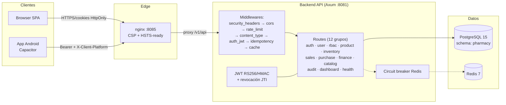
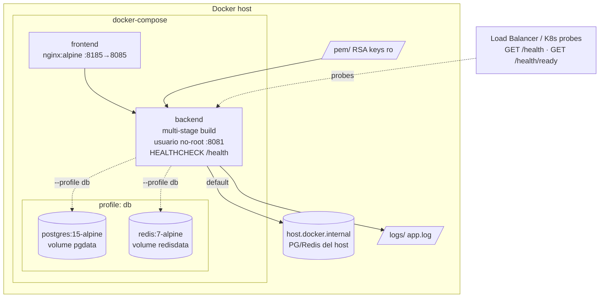
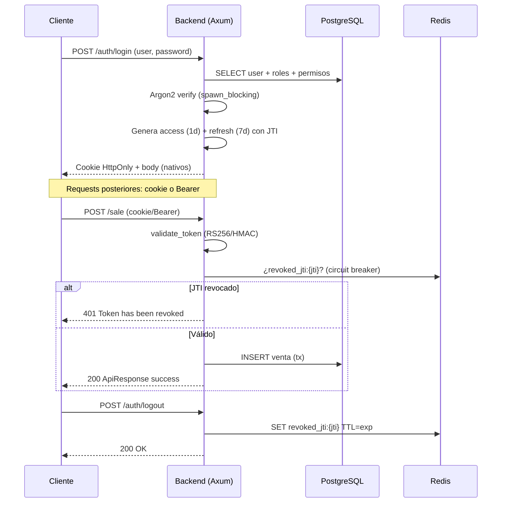
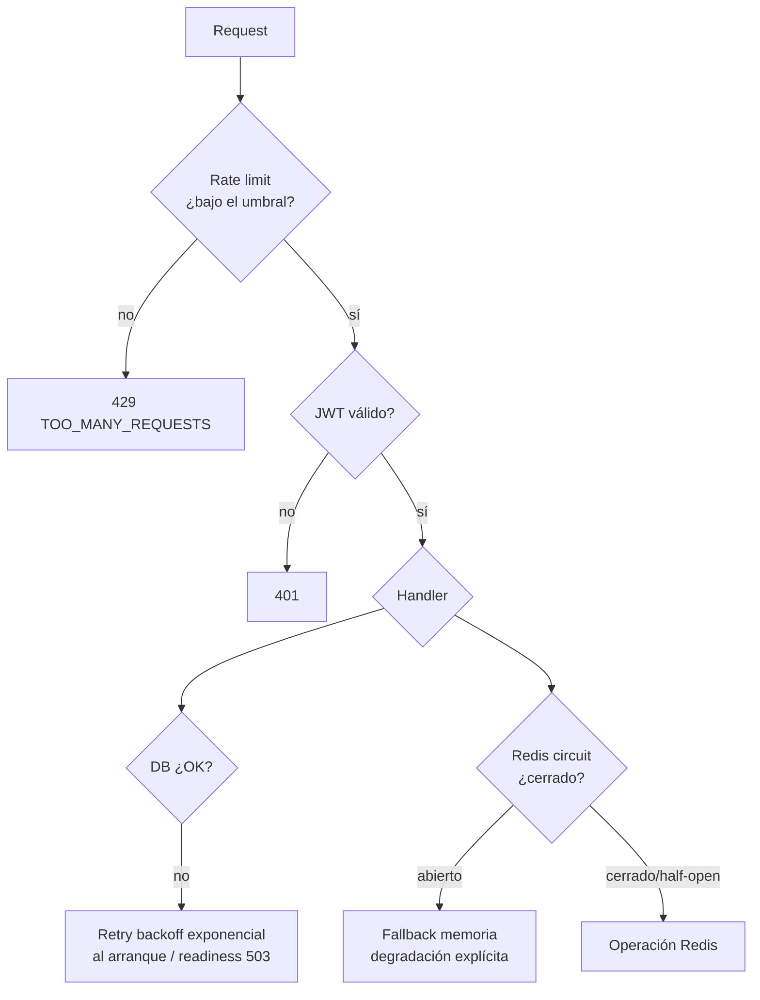

# 🏗️ Diagrama de Arquitectura — Pharmacy

> DOC-4 del [PLAN_MEJORAS.md](./PLAN_MEJORAS.md) · Diagramas en Mermaid (renderizan en GitHub/GitLab).

---

## 1. Diagrama de componentes

## 2. Diagrama de despliegue (Docker)

## 3. Flujo de autenticación

## 4. Estrategia de resiliencia

---

*Ver también: [INFORME_PROYECTO.md](./INFORME_PROYECTO.md), [PLAN_MEJORAS.md](./PLAN_MEJORAS.md), [CAMBIOLOG_MEJORAS.md](./CAMBIOLOG_MEJORAS.md).*
